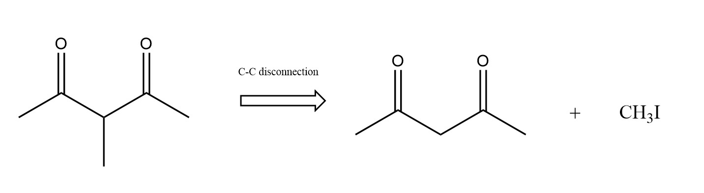

<h1 align="center">
chemicalbd
</h1>

<br>


A program that offers possible disconnections of chemical bonds/patterns in organic molecules.
For the moment, the package offers disconnections for the chemical patterns: thiols, ethers, acyl chlorides, esters, amides, amines, alcohols, alcohols with
double/triple bonds, aldehydes, alpha-beta unsaturated carbonyl compounds, 1,3 carbonyl compounds and alpha subtituted carbonyl compounds and 1,2 aminoalcohols.
For the full documentation of the package, visit the site https://octav19.github.io/chemicalbd/

## 🔥 Usage

The package is destined for usage in jupyter lab.
Open a jupyter notebook and import any of the functions of the package, as done in the example below.

```python
from chemicalbd.bond_disconnector import disconnections

# This is the core function. If you are interested only in a specific disconnection
# import another function, speciffic for that disconnection. 
reactants_list = disconnections(data)
```

By running such a cell (where data is a SMILES string), the possible disconnections are displayed automatically.
reactants_list becomes a list of Mol objects containing the reactants for all the known disconnections.

## 👩‍💻 Installation

Create a new environment. In this example, the name used is chemicalbd 

```
conda create -n chemicalbd python=3.10 
```

```
conda activate chemicalbd
```

Install jupyter lab, as the package is dedicated for usage in jupyter lab

```
(chemicalbd) pip install jupyterlab
```

In order to clone the repository on your local machine, run the following command:

```
(chemicalbd) git clone https://github.com/octav19/chemicalbd.git
```

To install the package, run:

```
(chemicalbd) pip install -e ".[test,doc]"
```

### Run tests and coverage

```
(chemicalbd) pip install tox
(chemicalbd) tox
```
